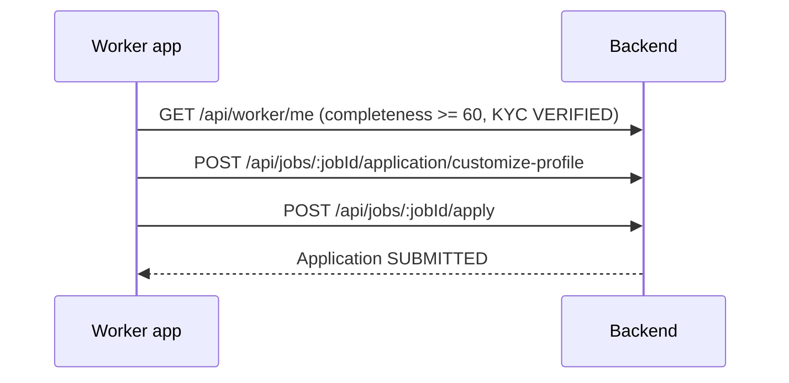

# Joballa Worker Portal — Frontend API Guide

**Last updated:** May 31, 2026  
**Production API:** [https://joballa-api.onrender.com](https://joballa-api.onrender.com)  
**Base paths:** `/api/worker`, `/api/jobs`, `/api/applications`, `/api/saved-jobs`, `/api/earnings`, `/files`  
**Audience:** Frontend developers building the **worker panel** (profile, dashboard, job feed, applications, post-job, earnings, engagements)

**Verified:** May 31, 2026 — `npm run test:e2e:worker-may2026` (**9/9 passed** against Neon DB). Deploy this backend before using new routes on production.

**Detailed payloads (optional):** [docsfromfrontend/WORKER_ROUTES_COMPREHENSIVE.md](../docsfromfrontend/WORKER_ROUTES_COMPREHENSIVE.md) — full request/response examples per route.

**Related:**

- Employer hiring flow: [FRONTEND_EMPLOYER_PORTAL_API_GUIDE_MAY_2026.md](./FRONTEND_EMPLOYER_PORTAL_API_GUIDE_MAY_2026.md)
- Admin moderation (KYC, jobs): [FRONTEND_ADMIN_PANEL_API_GUIDE_MAY_2026.md](./FRONTEND_ADMIN_PANEL_API_GUIDE_MAY_2026.md)
- Auth: [FRONTEND_AUTH_AND_REFRESH_GUIDE_MAY_2026.md](./FRONTEND_AUTH_AND_REFRESH_GUIDE_MAY_2026.md) (`/auth/*`)

---

## Table of contents

1. [Overview](#1-overview)
2. [Authentication](#2-authentication)
3. [Response format & errors](#3-response-format--errors)
4. [Route index](#4-route-index)
5. [Session & profile (`/api/worker`)](#5-session--profile-apiworker)
6. [Job discovery (`/api/jobs`)](#6-job-discovery-apijobs)
7. [Applications](#7-applications)
8. [Saved jobs](#8-saved-jobs)
9. [Earnings](#9-earnings)
10. [Engagements](#10-engagements)
11. [New in May 2026 (dashboard, worker jobs, notifications)](#11-new-in-may-2026-dashboard-worker-jobs-notifications)
12. [Apply flow, KYC & profile completeness](#12-apply-flow-kyc--profile-completeness)
13. [Status & enum reference](#13-status--enum-reference)
14. [Smoke tests & env vars](#14-smoke-tests--env-vars)
15. [Document history](#15-document-history)

---

## 1. Overview

The worker portal API lets **verified workers** (`Role.WORKER`):

- Build and maintain a **professional profile** (skills, work history, education, KYC, payment accounts)
- Use a **single dashboard** endpoint for home screen stats and recommended jobs
- **Search and browse** live jobs; cards include `hasApplied`, `saved`, `slug`, etc.
- **Save**, **hide**, or **report** jobs
- **Post jobs** as a worker (review queue) and review **incoming applications**
- **Customize** profile per job and **submit applications** (profile snapshot)
- Track **applications**, **hired engagements**, and **earnings**

All worker-scoped routes require:

```http
Authorization: Bearer <accessToken>
```

The JWT must belong to a user with role **`WORKER`**. Other roles receive **403 Forbidden**.

Responses are **raw JSON** (no `{ success, data }` wrapper), same as the employer portal.

### Base paths at a glance

| Area | Base path | Role |
|------|-----------|------|
| Profile & account | `/api/worker` | `WORKER` |
| Dashboard (home) | `/api/worker/dashboard` | `WORKER` |
| Worker-posted jobs | `/api/worker/jobs` | `WORKER` |
| Notifications | `/api/worker/notifications` | `WORKER` |
| Job feed & actions | `/api/jobs` | `WORKER` |
| Applications (outgoing) | `/api/applications` + `/api/jobs/:jobId/...` | `WORKER` |
| Saved jobs list | `/api/saved-jobs` | `WORKER` |
| Earnings | `/api/earnings` | `WORKER` |
| Engagements | `/api/worker/engagements` | `WORKER` |
| File uploads (KYC, etc.) | `/files` | `WORKER` (JWT) |

### Frontend migration (stop using employer routes for worker UI)

| Worker UI | Wrong (today) | Use instead |
|-----------|---------------|-------------|
| Post a job | `POST /api/employer/jobs` | `POST /api/worker/jobs` |
| Incoming applicants | `GET /api/employer/applicants` | `GET /api/worker/jobs/applications` |
| Profile editor save-all | PATCH-only | **`PUT /api/worker/profile`** (primary) |

---

## 2. Authentication

**Full guide:** [FRONTEND_AUTH_AND_REFRESH_GUIDE_MAY_2026.md](./FRONTEND_AUTH_AND_REFRESH_GUIDE_MAY_2026.md)

- Login: `POST /auth/login` → store **`accessToken`** and **`refreshToken`** from JSON.
- Refresh: `POST /auth/refresh` with body `{ "refreshToken": "..." }`.
- `GET /api/worker/me` on app launch; on **401** refresh once then retry.
- Signup: `POST /auth/register` → `POST /auth/verify`. Worker profile is auto-created on first login.

Use `credentials: 'include'` / `withCredentials: true` if you also rely on refresh cookies.

---

## 3. Response format & errors

### 3.1 Success

Most endpoints return the resource **directly** (HTTP 2xx).

**Paginated lists:** `{ "items": [], "total": 12, "page": 1, "limit": 20 }`

**DELETE** routes often return **`204 No Content`**.

### 3.2 `WorkerFullProfile` (profile GET / PUT / most PATCH profile routes)

Returned by `GET /api/worker/profile`, **`PUT /api/worker/profile`**, and profile PATCH routes (personal-info, skills, payment-details, etc.).

Key fields and **aliases** the backend accepts on input:

| API field | Aliases accepted on write |
|-----------|---------------------------|
| `summary` | `bio` |
| `languages` | `languagesSpoken` |
| `companyName` / `jobTitle` | `company` / `role` (work history) |
| `institution` | `school` (education) |
| `url` | `fileUrl` (documents) |

Includes: `workHistories[]`, `educations[]`, `certifications[]`, `documents[]`, `kycSubmissions[]`, `paymentAccounts[]`, `profileStrengthBreakdown`, `profileCompleteness`, `profileViews`, payment fields (`mobileMoneyProvider`, `accountNumber`, …).

Public profile (`GET .../public`) omits payment details and sensitive KYC images.

### 3.3 Job card (`GET /api/jobs`, dashboard `recommendedJobs`)

Each item includes at minimum:

`id`, `slug`, `title`, `description`, `companyName`, `companyLogoUrl`, `city`, `region`, `payRate`, `currency`, `jobType`, `workMode`, `payStructure`, `applicationCount`, `postedAt`, **`saved`**, **`hasApplied`**, **`applicationId`** (if applied), nested `employer`.

### 3.4 Errors

```json
{
  "statusCode": 403,
  "error": "ForbiddenException",
  "message": "Identity verification (KYC) must be approved before applying to jobs.",
  "path": "/api/jobs/uuid/apply",
  "timestamp": "2026-05-31T12:00:00.000Z"
}
```

| Code | Meaning |
|------|---------|
| `400` | Validation or business rule |
| `401` | Missing or invalid JWT |
| `403` | Wrong role, completeness &lt; 60%, or **KYC not VERIFIED** (apply / post-job) |
| `404` | Not found / not owned by worker |
| `409` | Already applied, duplicate save |
| `429` | Rate limit |

---

## 4. Route index

### Profile — `/api/worker` (27)

| # | Method | Route | Purpose |
|---|--------|-------|---------|
| 1 | GET | `/api/worker/me` | Session + summary + **profileStrengthBreakdown**, **profileViews** |
| 2 | GET | `/api/worker/profile` | Full **WorkerFullProfile** |
| 3 | **PUT** | **`/api/worker/profile`** | **Primary profile save** (partial body; replace nested arrays when sent) |
| 4 | GET | `/api/worker/profile/:workerId/public` | Public profile |
| 5 | PATCH | `/api/worker/profile/personal-info` | Name, location, languages, availability |
| 6 | PATCH | `/api/worker/profile/professional-summary` | Title, summary, industries, job types |
| 7 | PATCH | `/api/worker/profile/skills` | Replace skills array |
| 8 | POST | `/api/worker/profile/avatar` | Multipart → Cloudinary → **`avatarUrl`** |
| 9–16 | POST/PATCH/DELETE | `.../work-history`, `.../education`, `.../certifications` | CRUD sections |
| 17 | POST | `/api/worker/profile/documents` | Multipart → Cloudinary + DB row |
| 18 | GET | `/api/worker/profile/documents` | List (`url` / `fileUrl`) |
| 19 | DELETE | `/api/worker/profile/documents/:documentId` | `204` |
| 20 | POST | `/api/worker/profile/kyc` | Submit KYC URLs (+ **`selfieImageUrl`**) |
| 21 | GET | `/api/worker/profile/kyc` | Latest KYC status |
| 22 | PATCH | `/api/worker/profile/payment-details` | Legacy single MoMo/bank block |
| 23 | GET | `/api/worker/profile/payment-accounts` | List MoMo accounts |
| 24 | POST | `/api/worker/profile/payment-accounts` | Add account |
| 25 | PATCH | `/api/worker/profile/payment-accounts/:accountId` | Update |
| 26 | DELETE | `/api/worker/profile/payment-accounts/:accountId` | `204` |

### Dashboard & worker jobs — `/api/worker` (9)

| # | Method | Route | Purpose |
|---|--------|-------|---------|
| 27 | GET | `/api/worker/dashboard` | Home: stats, recommended jobs, recent applications |
| 28 | POST | `/api/worker/jobs` | Create job (KYC **VERIFIED**; `asDraft` optional) |
| 29 | GET | `/api/worker/jobs` | List jobs **created by this worker** |
| 30 | GET | `/api/worker/jobs/:jobId` | Owner job detail |
| 31 | PATCH | `/api/worker/jobs/:jobId` | Update |
| 32 | PATCH | `/api/worker/jobs/:jobId/status` | Status transition |
| 33 | DELETE | `/api/worker/jobs/:jobId` | `204` |
| 34 | GET | `/api/worker/jobs/applications` | **Incoming** applicants on worker's jobs |
| 35 | GET | `/api/worker/jobs/applications/:applicationId` | Applicant detail + `profileSnapshot` |

### Jobs feed — `/api/jobs` (8)

| # | Method | Route | Purpose |
|---|--------|-------|---------|
| 36 | GET | `/api/jobs` | Search/filter (**normalized** job cards) |
| 37 | GET | `/api/jobs/:jobId` | Detail + `hasApplied` / `saved` when authenticated |
| 38–43 | POST/DELETE/GET | save, hide, report, share | Same as before |

### Applications — outgoing (5)

| # | Method | Route | Purpose |
|---|--------|-------|---------|
| 44–48 | — | customize, apply, list, detail, archive | Same as before |

### Saved jobs (3) · Earnings (4) · Engagements (2) · Files (1)

| Area | Routes |
|------|--------|
| Saved jobs | `GET/DELETE /api/saved-jobs` (+ bulk DELETE) |
| Earnings | `GET summary`, `GET transactions`, **`GET transactions/:transactionId`**, `GET statement` |
| Engagements | `GET /api/worker/engagements`, `GET .../:engagementId` |
| Files | **`POST /files/verification-doc`** (multipart → `{ "url" }`) |

### Notifications (3)

| # | Method | Route | Purpose |
|---|--------|-------|---------|
| — | GET | `/api/worker/notifications` | In-app list (`filter=all\|jobs\|payments`) |
| — | PATCH | `/api/worker/notifications/:id/read` | Mark read |
| — | PATCH | `/api/worker/settings/notifications` | Toggles (**in-memory per user until DB prefs exist**) |

**Total:** 55+ worker-panel routes (was 43 before May 2026).

---

## 5. Session & profile (`/api/worker`)

### 5.1 `GET /api/worker/me`

Use on every cold start. `workerProfile` now includes:

- `profileStrengthBreakdown` — booleans per section (for checklist UI)
- `profileViews` — number (dashboard stat)
- `avatarUrl`, `profileCompleteness`, `availabilityStatus`, `verificationStatus`, etc.

### 5.2 `GET /api/worker/profile`

Full **WorkerFullProfile** (§3.2).

### 5.3 `PUT /api/worker/profile` — primary save

**Use this in `worker-profile-editor.tsx`** instead of many PATCH calls when saving the whole form.

- All top-level fields **optional** (partial update).
- Sending `workHistories[]`, `educations[]`, `certifications[]`, or `paymentAccounts[]` **replaces** that collection on the server.
- Recomputes `profileCompleteness` and `profileStrengthBreakdown`.
- **Response:** full `WorkerFullProfile` (`200`).

Example body (see comprehensive doc for full schema):

```json
{
  "firstName": "Ako",
  "lastName": "James",
  "city": "Buea",
  "languages": ["English", "French"],
  "professionalTitle": "Frontend Developer",
  "summary": "Senior developer...",
  "skills": ["React", "TypeScript"],
  "workHistories": [
    {
      "companyName": "TechCo",
      "jobTitle": "Developer",
      "startDate": "2023-01-01",
      "isCurrent": true
    }
  ],
  "paymentAccounts": [
    { "provider": "MTN_MOMO", "phone": "+237652036786", "isPrimary": true }
  ]
}
```

### 5.4 `GET /api/worker/profile/:workerId/public`

Path param = **WorkerProfile.id** (not User.id). Payment/KYC sensitive data excluded.

### 5.5 Section PATCH routes

Still supported for step-by-step flows. Most return **full WorkerFullProfile** after update (not a single nested row).

| Endpoint | Notes |
|----------|--------|
| `PATCH .../personal-info` | `languages[]` stored as `languagesSpoken` |
| `PATCH .../professional-summary` | `title` or `professionalTitle`; `summary` or `bio` |
| `PATCH .../skills` | **Required** `skills: string[]` — replaces list |
| `POST .../work-history` | Accepts `companyName`/`jobTitle` or `company`/`role` → **201** single row |
| `PATCH .../payment-details` | Single MoMo/bank block on profile |

### 5.6 `POST /api/worker/profile/avatar`

| | |
|---|---|
| **Content-Type** | `multipart/form-data`, field `file` |
| **Types** | JPEG, PNG, WEBP, max **5 MB** |
| **Response** | Full **WorkerFullProfile** with updated **`avatarUrl`** (Cloudinary) |

### 5.7 Documents & KYC

**Documents**

1. `POST /api/worker/profile/documents?type=CV|CERTIFICATE|PORTFOLIO|OTHER` — multipart `file`
2. `GET .../documents` — list with `url` / `fileUrl`
3. `DELETE .../documents/:documentId` — `204`

**KYC**

1. Upload images: **`POST /files/verification-doc`** (multipart `file`) → `{ "url": "https://..." }`
2. `POST .../kyc`:

```json
{
  "documentType": "NATIONAL_ID",
  "frontIdImageUrl": "https://...",
  "backIdImageUrl": "https://...",
  "selfieImageUrl": "https://..."
}
```

3. `GET .../kyc` — latest submission (`status`: `PENDING` | `VERIFIED` | `REJECTED`, etc.)
4. **400** if already `PENDING` or `VERIFIED`

Admin approves via `/admin/kyc/*`.

### 5.8 Payment accounts

Prefer **`paymentAccounts[]`** on `PUT /api/worker/profile` or dedicated CRUD:

```http
GET    /api/worker/profile/payment-accounts
POST   /api/worker/profile/payment-accounts     → 201
PATCH  /api/worker/profile/payment-accounts/:id
DELETE /api/worker/profile/payment-accounts/:id   → 204
```

Body for POST: `{ "provider": "MTN_MOMO", "phone": "+237...", "isPrimary": true }`

---

## 6. Job discovery (`/api/jobs`)

Only **`ACTIVE`** jobs appear in search.

### 6.1 `GET /api/jobs`

Same query params as before (`keyword`, `city`, `category`, `jobType`, `workMode`, `payStructure`, `minPay`, `maxPay`, `sortBy`, `sortOrder`, `page`, `limit`).

**Behaviour:**

- Empty/`all` filter values ignored.
- Hidden jobs excluded.
- If filters match nothing but jobs exist → unfiltered fallback + **`relaxedFilters: true`**.
- Each item is a **normalized job card** (§3.3) with **`hasApplied`** and **`saved`** for the current worker.

Filter out applied jobs in the UI if you want “only new” jobs (`hasApplied === false`).

### 6.2–6.6 Save, hide, report, share

Unchanged paths; see previous sections or comprehensive doc.

---

## 7. Applications

### 7.1 Outgoing flow (worker applies to employer jobs)



### 7.2 `POST /api/jobs/:jobId/apply`

| Rule | Detail |
|------|--------|
| Completeness | `profileCompleteness` ≥ **60** |
| KYC | Latest submission **`VERIFIED`** — else **403** |
| Duplicate | **409** if already applied |

Optional body: `jobSpecificNote`, `attachedDocuments[]`.

### 7.3 List / detail / archive

`GET /api/applications`, `GET /api/applications/:applicationId`, `DELETE ...` (soft archive) — unchanged.

---

## 8. Saved jobs

`GET /api/saved-jobs`, `DELETE /api/saved-jobs/:jobId`, bulk `DELETE /api/saved-jobs` with `{ "jobIds": [] }` — unchanged.

---

## 9. Earnings

### `GET /api/earnings/summary`

Totals: `totalEarned`, `pendingAmount`, `thisMonthTotal`, `currency` (`XAF`).

### `GET /api/earnings/transactions`

Paginated; query `status`, `engagementId`, `from`, `to`.

### `GET /api/earnings/transactions/:transactionId` — **new**

Single payment by id (same shape as list item). Use on earning detail page instead of scanning the list client-side. **404** if not this worker's payment.

### `GET /api/earnings/statement`

Query `from`, `to` — flat array for export.

---

## 10. Engagements

`GET /api/worker/engagements`, `GET /api/worker/engagements/:engagementId` — unchanged.

Created when employer sets application to **`HIRED`**.

---

## 11. New in May 2026 (dashboard, worker jobs, notifications)

### 11.1 `GET /api/worker/dashboard`

**One call for the worker home screen** (replaces multiple parallel calls).

**Response (`200`):**

```json
{
  "greeting": { "name": "Ako", "profileSetupMessage": "Complete your profile..." },
  "stats": {
    "activeApplications": { "count": 4, "trendLabel": "4 active" },
    "shortlisted": { "count": 2, "trendLabel": "+2 this week" },
    "profileViews": { "count": 28, "trendLabel": "28 total views" },
    "earnings": { "amount": 195000, "currency": "XAF", "trendLabel": "this month" }
  },
  "recommendedJobs": [ /* job cards §3.3, excludes already applied */ ],
  "applications": [ /* recent application list items */ ],
  "profileCompleteness": 75,
  "profileStrengthBreakdown": { /* same as /me */ }
}
```

### 11.2 Worker-posted jobs — `/api/worker/jobs`

| Route | Notes |
|-------|--------|
| `POST /api/worker/jobs` | Requires **KYC VERIFIED**. Non-draft → `UNDER_REVIEW`. Sets `createdByType: WORKER`. |
| `GET /api/worker/jobs` | Query `status`, `page`, `limit` |
| `GET/PATCH/DELETE` | Owner operations on own jobs |

**Do not use** `POST /api/employer/jobs` from the worker post-job flow.

Create body matches employer job shape (`title`, `city`, `description`, `jobType`, `payRate`, `payStructure`, `requiredSkills`, `asDraft`, …). See comprehensive doc for full example.

### 11.3 Incoming applications — `/api/worker/jobs/applications`

**Replaces** `GET /api/employer/applicants` on the worker applications tab.

Query: `status`, `keyword`, `jobId`, `page`, `limit`

Items include: `applicantName`, `applicantAvatarUrl`, `workerId`, `jobTitle`, `profileSnapshot`, `matchPercent`, etc.

Detail: `GET /api/worker/jobs/applications/:applicationId`

### 11.4 Notifications

```http
GET /api/worker/notifications?filter=all&page=1&limit=20
PATCH /api/worker/notifications/:id/read
PATCH /api/worker/settings/notifications   # body: pushEnabled, emailEnabled, jobsEnabled, messagesEnabled
```

List reads **`notifications`** table (`read`, `title`, `body`, `type`, `createdAt`).

Settings PATCH returns saved object but is **not persisted to DB yet** — do not rely on it across devices/sessions until a follow-up release.

### 11.5 `POST /files/verification-doc`

```http
POST /files/verification-doc
Authorization: Bearer <token>
Content-Type: multipart/form-data

file: <binary>
```

**Response (`201`):** `{ "url": "https://res.cloudinary.com/...", "secureUrl": "..." }`

Use URLs in `POST /api/worker/profile/kyc`. Legacy route `POST /files/verification-doc/:userId` still exists.

---

## 12. Apply flow, KYC & profile completeness

### Completeness weights (max 100)

| Section | Points |
|---------|--------|
| Full name | 10 |
| Professional title | 10 |
| Bio / summary | 10 |
| Skills (≥1) | 15 |
| Work history (≥1) | 15 |
| Education or certification (≥1) | 10 |
| Languages spoken | 5 |
| Profile photo (`avatarUrl`) | 5 |
| Payment details | 10 |
| KYC submitted | 10 |

**Minimum to apply:** **60**.

`profileStrengthBreakdown` on `/me` and `/dashboard` drives section checklists (separate from the numeric score).

### Frontend checklist before “Apply”

1. `profileCompleteness` ≥ 60  
2. KYC status **VERIFIED** (`GET /api/worker/profile/kyc`)  
3. Optional: `POST .../customize-profile`  
4. `POST .../apply`  
5. Handle **409** — already applied  

### Before “Post a job”

1. KYC **VERIFIED** — else **403**  
2. Platform must have a **Joballa department** employer profile (ops/seed); otherwise **400**  

---

## 13. Status & enum reference

### Application status

`SUBMITTED` | `SHORTLISTED` | `HIRED` | `REJECTED`

### Availability

`AVAILABLE` | `OPEN_TO_OFFERS` | `NOT_AVAILABLE`

### Job type / work mode / pay structure

See enums in comprehensive doc or Prisma schema.

### Momo provider

`MTN_MOMO` | `ORANGE_MONEY`

### KYC document type

`NATIONAL_ID` | `PASSPORT` | `DRIVERS_LICENSE`

### Engagement status

`ACTIVE` | `COMPLETED` | `TERMINATED`

---

## 14. Smoke tests & env vars

```bash
# Recommended — in-process e2e (uses .env DATABASE_URL)
npm run test:e2e:worker-may2026

# HTTP smokes (needs working POST /auth/login on API_URL)
npm run smoke:worker
npm run smoke:worker:may2026
npm run smoke:worker:session
npm run smoke:worker:profile
npm run smoke:worker:jobs

JOBALLA_WORKER_USE_LOCAL=1 API_URL=http://127.0.0.1:8000 npm run smoke:worker
```

| Variable | Purpose |
|----------|---------|
| `JOBALLA_WORKER_IDENTIFIER` | Worker email/phone |
| `JOBALLA_WORKER_PASSWORD` | Password |
| `JOBALLA_WORKER_TOKEN` | Skip login |
| `JOBALLA_WORKER_BOOTSTRAP=1` | Seed via DB |

**Local dev:** Ensure only **Joballa** listens on `API_URL` (port **8000** in `.env`). If another app owns the port, `/auth/login` may fail — use e2e tests instead.

---

## 15. Document history

| Date | Change |
|------|--------|
| May 24, 2026 | Initial guide (43 routes). |
| **May 31, 2026** | **Worker panel alignment:** `PUT /profile`, `WorkerFullProfile` + aliases, dashboard, worker jobs CRUD + incoming applications, normalized job cards, KYC gate on apply/post-job, Cloudinary avatar/documents, `POST /files/verification-doc`, payment accounts CRUD, earnings transaction by id, notifications. Route index 55+. Verified with `test:e2e:worker-may2026`. |

---

*Joballa Engineering — Worker Portal API (frontend team)*
