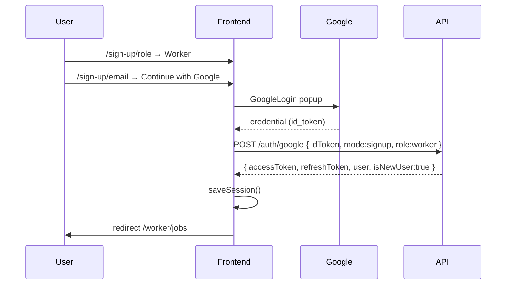

# Frontend Integration: Google Sign-In (Worker & Employer)

**Date:** June 2026  
**Backend status:** Implemented — `POST /auth/google`  
**Scope:** Platform users only. **Admin panel does not use Google.**

**Related:** [GOOGLE_SIGNIN_WORKER_EMPLOYER_PLAN.md](./GOOGLE_SIGNIN_WORKER_EMPLOYER_PLAN.md) · [GOOGLE_CLOUD_CONSOLE_SETUP.md](./GOOGLE_CLOUD_CONSOLE_SETUP.md)

---

## How to read this document

Each section explains **what the frontend must do** in order. API contracts use the same format as [AUTH_ROUTES.md](./AUTH_ROUTES.md).

**Base API:** `https://joballa-api.onrender.com` (prod) · `http://127.0.0.1:8000` (local)

---

## Overview — what you are building

1. User picks **Worker** or **Employer** on `/sign-up/role` (unchanged).  
2. On signup pages (`/sign-up/phone`, `/sign-up/email`), add **Continue with Google**.  
3. On sign-in pages (`/sign-in`), add **Continue with Google**.  
4. Google SDK returns an **`id_token`** (JWT string).  
5. Frontend sends that token to **`POST /auth/google`**.  
6. Backend returns the **same session** as password login: `accessToken`, `refreshToken`, `user`.  
7. Redirect by role: worker → `/worker/jobs`, employer → `/employer`.

No OTP step for Google signup.

---

## Step 1 — Google Cloud (coordinate with backend/DevOps)

Someone must complete [GOOGLE_CLOUD_CONSOLE_SETUP.md](./GOOGLE_CLOUD_CONSOLE_SETUP.md) and give you:

```env
VITE_GOOGLE_CLIENT_ID=123456789-xxxx.apps.googleusercontent.com
```

Use the **Web application** client ID. Same value must be set on the API as `GOOGLE_CLIENT_ID`.

---

## Step 2 — Install frontend package

```bash
npm install @react-oauth/google
```

---

## Step 3 — Wrap the app with Google provider

In your root layout (e.g. `main.tsx` or `App.tsx`):

```tsx
import { GoogleOAuthProvider } from "@react-oauth/google";

const googleClientId = import.meta.env.VITE_GOOGLE_CLIENT_ID;

if (!googleClientId) {
  console.warn("VITE_GOOGLE_CLIENT_ID is missing — Google Sign-In disabled");
}

export function AppProviders({ children }: { children: React.ReactNode }) {
  if (!googleClientId) return <>{children}</>;

  return (
    <GoogleOAuthProvider clientId={googleClientId}>
      {children}
    </GoogleOAuthProvider>
  );
}
```

Hide the Google button when `VITE_GOOGLE_CLIENT_ID` is unset (local dev without Google).

---

## Step 4 — Keep role in signup state

You already store this after `/sign-up/role`:

```ts
type PendingSignupIntent = {
  role: "worker" | "employer";
  preferredLanguage?: "eng" | "fre";
};
```

**Google signup requires `role`.** If user lands on signup without role, redirect to `/sign-up/role`.

Persist in `sessionStorage` or your auth store, e.g.:

```ts
const SIGNUP_INTENT_KEY = "joballa.pendingSignup";

export function saveSignupIntent(intent: PendingSignupIntent) {
  sessionStorage.setItem(SIGNUP_INTENT_KEY, JSON.stringify(intent));
}

export function readSignupIntent(): PendingSignupIntent | null {
  const raw = sessionStorage.getItem(SIGNUP_INTENT_KEY);
  return raw ? JSON.parse(raw) : null;
}

export function clearSignupIntent() {
  sessionStorage.removeItem(SIGNUP_INTENT_KEY);
}
```

---

## Step 5 — API client function

```ts
const API_BASE = import.meta.env.VITE_API_URL ?? "http://127.0.0.1:8000";

export type AuthSessionUser = {
  id: string;
  email: string | null;
  phone: string | null;
  role: "worker" | "employer";
  preferredLanguage: "eng" | "fre";
  accountStatus: "active" | "suspended" | "deactivated";
  profilePhotoUrl: string | null;
  workerProfileId: string | null;
  employerProfileId: string | null;
};

export type GoogleAuthResponse = {
  accessToken: string;
  refreshToken: string;
  user: AuthSessionUser;
  isNewUser: boolean;
};

export async function authWithGoogle(body: {
  idToken: string;
  mode: "signup" | "signin";
  role?: "worker" | "employer";
  preferredLanguage?: "eng" | "fre";
}): Promise<GoogleAuthResponse> {
  const res = await fetch(`${API_BASE}/auth/google`, {
    method: "POST",
    headers: { "Content-Type": "application/json" },
    credentials: "include", // refresh cookie
    body: JSON.stringify(body),
  });

  const data = await res.json().catch(() => ({}));

  if (!res.ok) {
    throw new ApiError(res.status, data?.message ?? "Google sign-in failed");
  }

  return data as GoogleAuthResponse;
}
```

Store tokens the **same way** as `POST /auth/login` and `POST /auth/verify`.

---

## Step 6 — Google button component

```tsx
import { GoogleLogin, type CredentialResponse } from "@react-oauth/google";
import { authWithGoogle, saveSession } from "@/features/auth/api";
import { readSignupIntent, clearSignupIntent } from "@/features/auth/signup-intent";
import { useNavigate } from "react-router-dom";

type Props = {
  mode: "signup" | "signin";
};

export function GoogleSignInButton({ mode }: Props) {
  const navigate = useNavigate();

  const handleSuccess = async (response: CredentialResponse) => {
    const idToken = response.credential;
    if (!idToken) return;

    try {
      if (mode === "signup") {
        const intent = readSignupIntent();
        if (!intent?.role) {
          navigate("/sign-up/role");
          return;
        }

        const session = await authWithGoogle({
          idToken,
          mode: "signup",
          role: intent.role,
          preferredLanguage: intent.preferredLanguage ?? "eng",
        });

        saveSession(session);
        clearSignupIntent();
        navigate(session.user.role === "worker" ? "/worker/jobs" : "/employer");
        return;
      }

      const session = await authWithGoogle({ idToken, mode: "signin" });
      saveSession(session);
      navigate(session.user.role === "worker" ? "/worker/jobs" : "/employer");
    } catch (err) {
      // see Step 8 — error handling
      showToast(mapGoogleAuthError(err));
    }
  };

  return (
    <div className="google-signin-wrapper">
      <GoogleLogin
        onSuccess={handleSuccess}
        onError={() => showToast("Google Sign-In was cancelled or failed.")}
        text={mode === "signup" ? "signup_with" : "signin_with"}
        shape="rectangular"
        theme="outline"
        size="large"
        width="100%"
      />
    </div>
  );
}
```

---

## Step 7 — Place buttons on pages

| Page | Component | `mode` |
| --- | --- | --- |
| `/sign-up/phone` | `<GoogleSignInButton mode="signup" />` | `signup` |
| `/sign-up/email` | `<GoogleSignInButton mode="signup" />` | `signup` |
| `/sign-in` | `<GoogleSignInButton mode="signin" />` | `signin` |

**UI pattern:**

```
[ Phone input        ]
[ Password input     ]
[ Create account     ]

────────── or ──────────

[ Continue with Google ]
```

Do **not** add Google to admin login.

---

## Step 8 — Error handling

Backend returns NestJS-style `{ message: string }` or `{ statusCode, message }`.

| HTTP | Message (examples) | Frontend action |
| --- | --- | --- |
| `400` | Invalid Google token / role required | Show retry; check client ID |
| `403` | Account suspended | Show support message (`ACCOUNT_SUSPENDED` shape may apply on other routes) |
| `404` | No account found (signin) | “No account — sign up first” + link to `/sign-up/role` |
| `409` | Email already exists (password account) | “Sign in with password” + link to `/sign-in` |
| `409` | Role mismatch | “This Google account is registered as a worker/employer” |

```ts
export function mapGoogleAuthError(err: unknown): string {
  if (err instanceof ApiError) {
    if (err.status === 404) {
      return "No Joballa account for this Google account. Please sign up first.";
    }
    if (err.status === 409) {
      return err.message;
    }
    if (err.status === 400) {
      return err.message;
    }
  }
  return "Google Sign-In failed. Please try again.";
}
```

---

## Step 9 — Redirect rules (same as OTP verify)

```ts
export function redirectAfterAuth(user: AuthSessionUser, isNewUser: boolean) {
  if (user.role === "worker") {
    // Optional: new users → profile edit
    return isNewUser ? "/worker/profile/edit" : "/worker/jobs";
  }
  return isNewUser ? "/employer/profile/edit" : "/employer";
}
```

Product default in plan: always `/worker/jobs` and `/employer` — pick one policy and stay consistent.

---

## Step 10 — Session & refresh (unchanged)

After Google auth, use existing token storage:

- `accessToken` → memory / localStorage (your current pattern)  
- `refreshToken` → body + httpOnly cookie (backend sets `refreshToken` cookie)  
- `POST /auth/refresh` — unchanged  
- `POST /auth/logout` — unchanged  
- `GET /auth/me` — unchanged  

Google users do **not** need a password to stay logged in.

---

## API contract — `POST /auth/google`

### What it does

Verifies Google `id_token` server-side, finds or creates a worker/employer user, issues Joballa JWT session.

### Auth

Public (rate-limited: 10 requests / 15 min per IP, same as login).

### Sends

```ts
type GoogleAuthRequest = {
  idToken: string;                    // required — from GoogleLogin onSuccess
  mode: "signup" | "signin";        // required
  role?: "worker" | "employer";     // required when mode === "signup"
  preferredLanguage?: "eng" | "fre"; // optional, default "eng" on signup
};
```

**Examples — signup (worker):**

```json
{
  "idToken": "eyJhbGciOiJSUzI1NiIs...",
  "mode": "signup",
  "role": "worker",
  "preferredLanguage": "eng"
}
```

**Examples — signin:**

```json
{
  "idToken": "eyJhbGciOiJSUzI1NiIs...",
  "mode": "signin"
}
```

### Receives — `200 OK`

```ts
type GoogleAuthResponse = {
  accessToken: string;
  refreshToken: string;
  isNewUser: boolean;
  user: {
    id: string;
    email: string | null;
    phone: string | null;
    role: "worker" | "employer";
    preferredLanguage: "eng" | "fre";
    accountStatus: "active" | "suspended" | "deactivated";
    profilePhotoUrl: string | null;
    workerProfileId: string | null;
    employerProfileId: string | null;
  };
};
```

Also sets httpOnly refresh cookie (same as login).

### Errors

| Status | When |
| --- | --- |
| `400` | Missing/invalid token, unverified Google email, `role` missing on signup, Google not configured server-side |
| `403` | Account suspended (`ACCOUNT_SUSPENDED` body) or deactivated |
| `404` | Sign-in: no matching account |
| `409` | Email already used with password; role mismatch; email linked to different Google account |

**Suspended response shape:**

```json
{
  "success": false,
  "error": {
    "code": "ACCOUNT_SUSPENDED",
    "message": "Account suspended. Contact support."
  }
}
```

---

## Password login interaction

If user registered with Google only (no password):

- `POST /auth/login` with password returns:  
  `"This account uses Google Sign-In. Continue with Google instead."`

Show Google button on sign-in page for these users.

---

## Sign-in auto-link (password → Google)

If a user previously registered with **email + password** and later uses **Google sign-in** (`mode: "signin"`) with the **same email**:

- Backend links `google_id` automatically on first successful Google sign-in.  
- They can then use either password or Google.

**Signup** with Google when email already has password account → `409` — direct user to sign-in.

---

## Environment variables (frontend)

| Variable | Example | Required |
| --- | --- | --- |
| `VITE_GOOGLE_CLIENT_ID` | `xxx.apps.googleusercontent.com` | Yes (for Google button) |
| `VITE_API_URL` | `http://127.0.0.1:8000` | Yes |

---

## QA checklist (frontend)

- [ ] Sign up as **worker** via Google → `user.role === "worker"`, `workerProfileId` set  
- [ ] Sign up as **employer** via Google → `employerProfileId` set  
- [ ] Sign in again via Google → `isNewUser === false`  
- [ ] Signup without visiting `/sign-up/role` → redirected to role page  
- [ ] Sign-in with unknown Google account → friendly 404 message  
- [ ] Password account + Google signup same email → 409 with sign-in hint  
- [ ] Refresh token works after Google login  
- [ ] Admin login page has **no** Google button  
- [ ] `credentials: "include"` on `/auth/google` for cookie  

---

## Sequence diagram



---

## Files to touch (suggested)

| File | Change |
| --- | --- |
| `.env` / `.env.local` | `VITE_GOOGLE_CLIENT_ID` |
| `main.tsx` | `GoogleOAuthProvider` |
| `features/auth/api.ts` | `authWithGoogle()` |
| `features/auth/signup-intent.ts` | role persistence |
| `pages/sign-up/phone.tsx` | Google button |
| `pages/sign-up/email.tsx` | Google button |
| `pages/sign-in.tsx` | Google button |
| `features/auth/session.ts` | reuse existing save/load |

---

## Out of scope (v1)

- Google on admin panel  
- Apple Sign-In  
- “Link Google” in settings while logged in  
- Phone-only accounts via Google (Google requires email)
