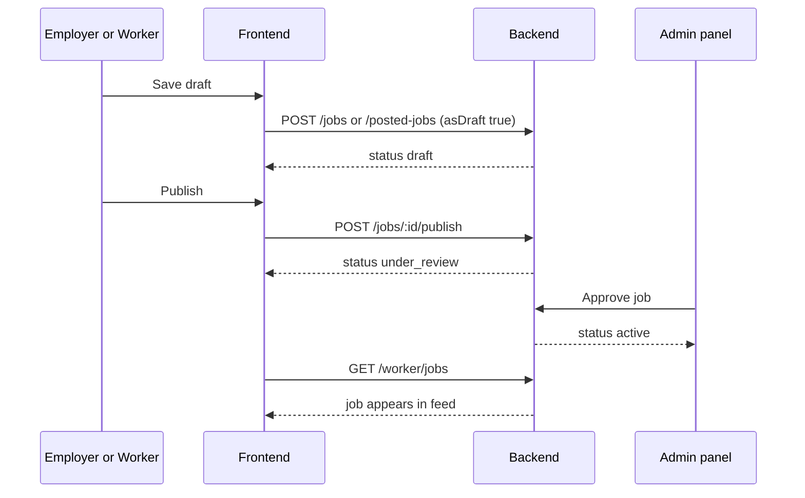
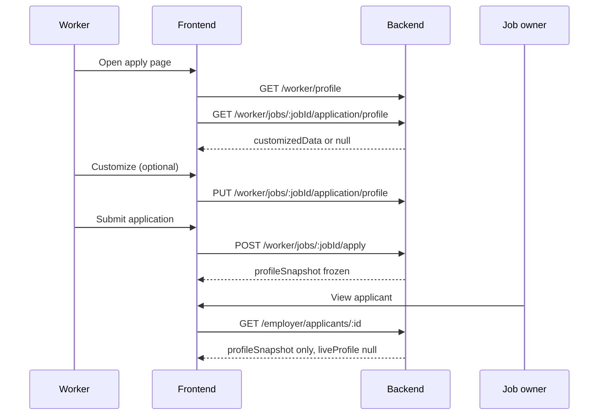

# FRONTEND INTEGRATION — PM Platform Review (June 2026)

**Audience:** Frontend (Employer portal, Worker portal, shared components)  
**Backend status:** Implemented on `development`  
**Companion docs:** [BACKEND_PM_PLATFORM_REVIEW_REQUIREMENTS.md](./BACKEND_PM_PLATFORM_REVIEW_REQUIREMENTS.md), [FRONTEND_EMPLOYER_ROUTES.md](./FRONTEND_EMPLOYER_ROUTES.md), [FRONTEND_WORKER_ROUTES.md](./FRONTEND_WORKER_ROUTES.md)

All routes below use Bearer auth. Base URL examples:

- Local: `http://127.0.0.1:8000`
- Production: `https://joballa-api.onrender.com`

Lists return `{ data, page, limit, total, totalPages }` unless noted.

---

## 1. Product rules (read this first)

### 1.1 Every job must be admin-reviewed before going live

Applies to **employer jobs** and **worker-posted jobs**.

```
draft  →  user clicks Publish  →  under_review  →  admin approves  →  active
```

| Status | Meaning for UI |
| --- | --- |
| `draft` | Saved in “My Jobs” / “Posted Jobs”. Incomplete fields OK. |
| `under_review` | Submitted to admin. Show “Pending review”. **Not searchable.** |
| `active` | Live — appears in job feed, accepts applications. |
| `rejected` | Admin rejected — show reason if available; user can edit and publish again. |
| `paused` / `closed` | Employer/worker owner controls after approval. |

**Frontend must not** set status to `active`. Only admin can approve.

### 1.2 Profile snapshot at apply time

| Data | Rule |
| --- | --- |
| Master profile (`GET /worker/profile`) | Never changed by apply or customize |
| Per-job customize draft | Optional edits before apply; stored per job |
| `applications.profileSnapshot` | Frozen when worker clicks Apply |
| Job owner views applicant | **Snapshot only** until status is `hired` |
| Worker views own application | Same snapshot JSON they submitted |
| After `hired` | Job owner also receives `liveProfile` on applicant detail |

### 1.3 Applicant status (no bookmarks)

Use the same status workflow as employer today:

`submitted` → `shortlisted` → `hired` | `rejected`

There is **no** separate bookmark/favourite table. “Saving” an applicant = changing status (e.g. shortlist).

### 1.4 Document downloads

**Always use `downloadUrl` for Download buttons** — not raw `url` from Cloudinary.

| Context | Field to use |
| --- | --- |
| CV export | `GET /worker/profile/cv-export/status` → `downloadUrl` |
| Applicant documents | `profileSnapshot.documents[].downloadUrl` |
| Attached files | `attachedDocuments[].downloadUrl` |

`downloadUrl` is a path on the API (e.g. `/employer/applicants/{id}/files/0/download`). Prepend your API base URL and open in a new tab or use `window.location.href` / `<a download>`.

### 1.5 Two different “jobs” lists for workers

| Route | Purpose |
| --- | --- |
| `GET /worker/jobs` | **Marketplace** — browse active jobs to apply |
| `GET /worker/posted-jobs` | **My posted jobs** — jobs this worker created as hirer |

Do not merge these in one UI tab without clear labels.

---

## 2. Shared types

### 2.1 Application profile snapshot

Returned on application detail (worker + job owner) and inside applicant detail (employer + worker hirer).

```ts
type ApplicationProfileSnapshot = {
  fullName: string;
  headline?: string | null;
  professionalTitle?: string | null;
  avatarUrl?: string | null;
  verificationStatus?: string;
  city?: string | null;
  region?: string | null;
  country?: string | null;
  location?: string | null;
  phone?: string | null;
  summary?: string | null;
  professionalSummary?: string | null;
  bio?: string | null;
  skills: string[];
  highlightedSkills?: string[];
  languagesSpoken?: string[];
  workHistory?: WorkHistoryEntry[];
  educations?: EducationEntry[];
  certifications?: CertificationEntry[];
  documents?: DocumentEntry[];
  customizedForJob?: boolean;
  snapshotAt?: string;
};

type CertificationEntry = {
  id?: string;
  name: string;
  issuer?: string | null;
  issueDate?: string | null;
  expiryDate?: string | null;
  credentialUrl?: string | null;
};

type DocumentEntry = {
  name: string;
  fileName?: string;
  type?: string;
  mimeType?: string;
  size?: string | number | null;
  url?: string;           // storage URL — do not use for Download button
  downloadUrl?: string;   // USE THIS for downloads
};

type WorkHistoryEntry = {
  id?: string;
  companyName?: string;
  company?: string;
  jobTitle?: string;
  role?: string;
  period?: string;
  description?: string | null;
};

type EducationEntry = {
  id?: string;
  institution: string;
  degree?: string | null;
  fieldOfStudy?: string | null;
  period?: string;
};
```

### 2.2 Applicant card (employer + worker hirer)

```ts
type ApplicantCard = {
  id: string;
  applicationId: string;
  jobId: string;
  jobTitle: string;
  workerId: string;
  workerName: string;
  workerHeadline?: string | null;
  workerEmail?: string | null;
  workerPhotoUrl?: string | null;
  workerLocation?: string | null;
  topSkills: string[];
  verificationStatus: string;
  availabilityStatus?: string | null;
  status: "submitted" | "shortlisted" | "hired" | "rejected";
  matchScore?: number | null;
  submittedAt: string;
};
```

### 2.3 Applicant detail (employer + worker hirer)

```ts
type ApplicantDetail = ApplicantCard & {
  coverNote?: string | null;
  jobSpecificNote?: string | null;
  reviewerNotes?: string | null;   // same as employerNotes
  employerNotes?: string | null;
  attachedDocuments: DocumentEntry[];
  profileSnapshot: ApplicationProfileSnapshot;
  liveProfile: LiveWorkerProfile | null;  // null until hired
  job: JobDetail;
};

type LiveWorkerProfile = {
  fullName: string | null;
  professionalTitle?: string | null;
  shortBio?: string | null;
  city?: string | null;
  region?: string | null;
  country?: string | null;
  skills: string[];
  verificationStatus: string;
  photoUrl?: string | null;
  phone?: string | null;
  email?: string | null;
};
```

### 2.4 Posted job card (employer My Jobs + worker Posted Jobs)

Same shape as `EmployerJobCard` in [FRONTEND_EMPLOYER_ROUTES.md](./FRONTEND_EMPLOYER_ROUTES.md).

---

## 3. Employer portal changes

### 3.1 Job lifecycle UI

#### Create draft — `POST /employer/jobs`

**When:** User clicks “Save as draft” on create job form.

**Sends:**

```ts
{
  asDraft: true;
  title?: string;
  departmentId?: string;      // optional for draft
  employmentType?: string;    // optional — defaults server-side
  payStructure?: string;
  city?: string;
  description?: string;
  payAmount?: number;
  // ... other job fields, all optional for draft
}
```

**Receives:**

```ts
{
  jobId: string;
  status: "draft";
  message: "Job saved as draft.";
}
```

**UI:** Allow saving with missing department, pay, description, etc.

#### Publish draft — `POST /employer/jobs/:jobId/publish` **(NEW)**

**When:** User clicks “Publish” / “Submit for review” on a draft job.

**Sends:** Optional final field values in body (same fields as job form). Path `jobId` required.

```ts
// body optional — can send {} if draft already complete
{
  title?: string;
  departmentId?: string;
  description?: string;
  payAmount?: number;
  // ...
}
```

**Receives:**

```ts
{
  jobId: string;
  status: "under_review";
  message: "Job submitted for review. Joballa admin will review before it goes live.";
}
```

**Errors:** `400` with `{ message, fieldErrors?: Record<string, string[]> }` — show field errors on form.

#### Update draft — `POST /employer/jobs/:jobId/draft` or `PATCH /employer/jobs/:jobId`

**When:** User edits a draft job.

**Sends:** Partial job fields.

**Receives:** Full `JobDetail` object.

**Note:** Does not change status. Job stays `draft`.

#### Non-draft create — `POST /employer/jobs` (without `asDraft`)

Still supported: creates job and submits directly to `under_review` with full validation.

---

### 3.2 Applicant management (existing routes — behaviour changed)

#### List — `GET /employer/applicants`

**Query:** `page`, `limit`, `jobId`, `status`, `search`

**Receives:** `Paginated<ApplicantCard>`

**Change:** Card fields (name, photo, skills) now come from **apply-time snapshot**, not live profile.

#### Detail — `GET /employer/applicants/:applicationId`

**Receives:** `ApplicantDetail`

**Changes:**

| Field | Behaviour |
| --- | --- |
| `profileSnapshot` | Full snapshot at apply time (skills, work, education, **certifications**, documents) |
| `profileSnapshot.documents[].downloadUrl` | Use for PDF/download buttons |
| `liveProfile` | **`null`** until status is `hired` |
| `liveProfile` | Populated when `status === "hired"` |

**UI rules:**

- Before hire: render only `profileSnapshot` sections.
- After hire: show snapshot as “Application profile” and `liveProfile` as “Current profile” (optional tab).

#### Update status — `PATCH /employer/applicants/:applicationId/status`

**Sends:**

```ts
{
  status: "submitted" | "shortlisted" | "hired" | "rejected";
  note?: string;
}
```

**Receives:** Updated `ApplicantDetail`.

**UI:** Shortlist / Reject / Hire buttons — same as today. No bookmark feature.

#### Download file — `GET /employer/applicants/:applicationId/files/:fileIndex/download` **(NEW)**

**When:** User clicks Download on a document in applicant detail.

**Sends:** Bearer token. `fileIndex` is 0-based index in merged document list (profile snapshot docs + attached).

**Receives:** Binary file stream (`Content-Disposition: attachment`).

**Frontend:**

```ts
const url = `${API_BASE}${applicant.profileSnapshot.documents[0].downloadUrl}`;
// Option A: window.open(url) with Authorization header via fetch+blob
// Option B: <a href> if you proxy auth via cookie (not typical for SPA)
```

Recommended SPA pattern:

```ts
async function downloadApplicantFile(downloadUrl: string, token: string, fileName: string) {
  const res = await fetch(`${API_BASE}${downloadUrl}`, {
    headers: { Authorization: `Bearer ${token}` },
  });
  const blob = await res.blob();
  const link = document.createElement("a");
  link.href = URL.createObjectURL(blob);
  link.download = fileName;
  link.click();
}
```

---

## 4. Worker portal changes

### 4.1 Marketplace (unchanged base path)

`GET /worker/jobs` — browse **active** jobs posted by employers **or other workers**.

**Job card `ownerName`:** Now shows worker poster’s `fullName` when owner is a worker (not only company name).

**Apply blocked:** `POST /worker/jobs/:jobId/apply` returns `400` if worker tries to apply to their own job.

---

### 4.2 Apply flow (customize → apply → snapshot)

#### Step 1 — Preview master profile

Use existing `GET /worker/profile` for live profile preview on apply page.

#### Step 2 — Customize (optional)

**Load draft:** `GET /worker/jobs/:jobId/application/profile`

**Receives:**

```ts
{
  id?: string;
  applicationId: null;
  jobId: string;
  profileId?: string;
  customizedData: CustomizeProfileBody | null;
  createdAt?: string;
  updatedAt?: string;
}
```

**Save draft:** `PUT /worker/jobs/:jobId/application/profile`

**Sends:** `CustomizeProfileBody` (bio, skills, detach section IDs, etc.)

**Receives:** Same shape with `customizedData` populated.

**UI:** Customize modal/page edits **only** this job’s preview. Do not call `PATCH /worker/profile`.

#### Step 3 — Apply

**`POST /worker/jobs/:jobId/apply`**

**Sends:**

```ts
{
  coverNote?: string;
  jobSpecificNote?: string;  // alias for coverNote
  source?: string;
  attachedDocuments?: Array<{ name: string; url?: string; type?: string }>;
}
```

**Receives:** Application detail with frozen `profileSnapshot`.

**After apply:** Customize draft is deleted server-side.

---

### 4.3 My applications (worker as applicant)

#### List — `GET /worker/applications`

Canonical path. Aliases: `GET /worker/jobs/applications`.

**Receives:** Paginated list with `status` per application.

#### Detail — `GET /worker/applications/:applicationId`

**Receives:**

```ts
{
  id: string;
  status: string;
  submittedAt: string;
  job: WorkerJobCard;
  employerNotes?: string | null;  // notes from job owner
  jobId: string;
  workerId: string;
  coverNote?: string | null;
  attachedDocuments: DocumentEntry[];  // with downloadUrl
  profileSnapshot: ApplicationProfileSnapshot;  // what they submitted
}
```

**UI:** Show “Your submitted profile” from `profileSnapshot`. Use `downloadUrl` for documents.

#### Download own application file — `GET /worker/applications/:applicationId/files/:fileIndex/download` **(NEW)**

Same pattern as employer applicant download.

---

### 4.4 Posted jobs (worker as hirer) **(NEW)**

Mirror employer “My Jobs” under `/worker/posted-jobs`.

#### List — `GET /worker/posted-jobs`

**Query:** `page`, `limit`, `status` (`draft` | `under_review` | `active` | …)

**Receives:** `Paginated<PostedJobCard>` (same counts as employer: `applicantsCount`, `shortlistedCount`, `hiredCount`).

#### Create — `POST /worker/posted-jobs`

**Sends:** Same body as `POST /employer/jobs` (`asDraft: true` for draft).

**Receives:**

```ts
{
  jobId: string;
  status: "draft" | "under_review";
  submissionScore?: { score: number; tier: string };
  message: string;
}
```

#### Detail — `GET /worker/posted-jobs/:jobId`

**Receives:** Full job detail (including `description`, `requirements`, `status`).

#### Update draft — `PATCH /worker/posted-jobs/:jobId` or `POST /worker/posted-jobs/:jobId/draft`

**Sends:** Partial fields.

#### Publish — `POST /worker/posted-jobs/:jobId/publish`

Same contract as employer publish → `under_review`.

#### Delete — `DELETE /worker/posted-jobs/:jobId`

**Receives:** `{ ok: true }`

#### Departments for job form — `GET /worker/departments`

**Receives:** Same list shape as `GET /employer/departments`.

---

### 4.5 Applicant inbox (worker as hirer) **(NEW)**

Mirror employer `/employer/applicants/*` under `/worker/applicants/*`.

| Action | Route |
| --- | --- |
| Filter metadata | `GET /worker/applicants/filters` |
| List | `GET /worker/applicants` |
| Detail | `GET /worker/applicants/:applicationId` |
| Shortlist / reject / hire | `PATCH /worker/applicants/:applicationId/status` |
| Notes | `PATCH /worker/applicants/:applicationId/notes` |
| Download file | `GET /worker/applicants/:applicationId/files/:fileIndex/download` |

**Contracts:** Identical to employer applicant section (§3.2). Response type is `ApplicantDetail`.

**UI suggestion:** Reuse the same ApplicantList + ApplicantDetail components as employer; switch API prefix based on portal.

---

## 5. CV export

No new routes. Behaviour reminder:

| Route | Use |
| --- | --- |
| `GET /worker/profile/cv-export/status` | Check `available`, `isOutdated`, get `downloadUrl` |
| `GET /worker/profile/cv-export` | Download cached PDF |
| `POST /worker/profile/cv-export` | Regenerate PDF |

**Frontend:** Never display raw Cloudinary URL from profile for CV. Always use `downloadUrl` from status endpoint.

---

## 6. Suggested page map

### Employer

| Page | Key endpoints |
| --- | --- |
| My Jobs (drafts) | `GET /employer/jobs?status=draft` |
| Create / edit job | `POST /employer/jobs`, `PATCH /employer/jobs/:id`, `POST .../draft` |
| Publish job | `POST /employer/jobs/:id/publish` |
| Applicants list | `GET /employer/applicants` |
| Applicant detail | `GET /employer/applicants/:id` |
| Shortlist / hire | `PATCH /employer/applicants/:id/status` |

### Worker

| Page | Key endpoints |
| --- | --- |
| Job feed | `GET /worker/jobs` |
| Apply + customize | `GET/PUT .../application/profile`, `POST .../apply` |
| My applications | `GET /worker/applications` |
| Application detail | `GET /worker/applications/:id` |
| Posted jobs (My Jobs) | `GET /worker/posted-jobs` |
| Create / edit posted job | `POST /worker/posted-jobs`, `PATCH /worker/posted-jobs/:id` |
| Publish posted job | `POST /worker/posted-jobs/:id/publish` |
| Applicants to my jobs | `GET /worker/applicants` |
| Review applicant | `GET /worker/applicants/:id`, `PATCH .../status` |

---

## 7. End-to-end flows (diagrams)

### 7.1 Job publish flow



### 7.2 Apply with customize flow



---

## 8. Migration checklist for frontend

- [ ] Employer job form: allow incomplete draft save; validate only on Publish
- [ ] Wire `POST /employer/jobs/:jobId/publish` (not `PATCH status: active`)
- [ ] Applicant detail: render `profileSnapshot` only; show `liveProfile` section when `status === "hired"`
- [ ] All document Download buttons: use `downloadUrl` + Bearer fetch blob pattern
- [ ] CV download: use `/worker/profile/cv-export` paths only
- [ ] Worker: add **Posted Jobs** section (`/worker/posted-jobs`)
- [ ] Worker: add **Applicants** inbox (`/worker/applicants`) for jobs they posted
- [ ] Worker apply: wire customize draft routes before apply
- [ ] Worker application detail: show submitted `profileSnapshot`
- [ ] Job feed: display worker poster name when `owner` is worker
- [ ] Block apply UI on own posted jobs (API returns 400)
- [ ] Status filters: `submitted`, `shortlisted`, `hired`, `rejected` — no bookmark UI

---

## 9. Confirmed product decisions

| Topic | Decision |
| --- | --- |
| Worker job posting | Full jobs (`POST /worker/posted-jobs`) — Option A |
| Publish result | Always `under_review`; admin sets `active` |
| Live profile for job owner | Only when applicant `status === "hired"` |
| Saving applicants | Status workflow only (shortlist/reject/hire) |
| Document downloads | API `downloadUrl` paths |
| Customize preview | Existing `GET/PUT .../application/profile` |
| Worker applies to worker job | Yes (except own jobs) |
| Informal requests | Kept alongside full posted jobs |

---

## 10. Questions

Contact backend if any field is missing from responses. Prefer `GET` detail endpoints over guessing from list cards.
