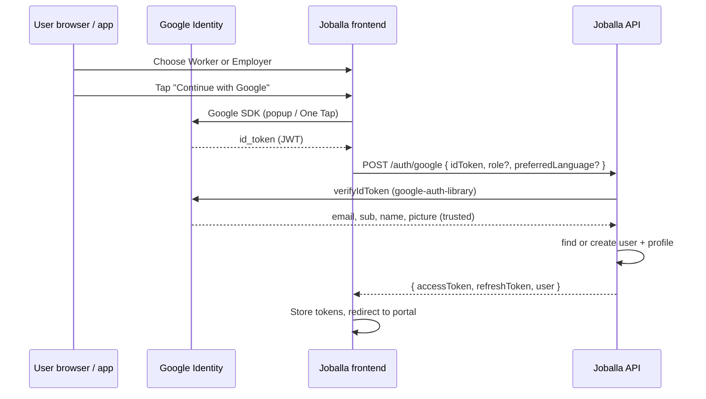

# Google Sign-In — Worker & Employer (ID Token Flow)

**Date:** June 2026  
**Audience:** Frontend + backend teams  
**Scope:** Platform users only (`worker` | `employer`). **Admin auth is unchanged** — no Google on `/admin/auth/*`.  
**Status:** Backend **implemented** — see [FRONTEND_GOOGLE_SIGNIN.md](./FRONTEND_GOOGLE_SIGNIN.md) and [GOOGLE_CLOUD_CONSOLE_SETUP.md](./GOOGLE_CLOUD_CONSOLE_SETUP.md).

This document explains **how everything unfolds** when a user picks Worker or Employer, lands on the signup/sign-in pages, and chooses **Continue with Google**. It matches Joballa’s existing JWT session model (`accessToken` + `refreshToken` + cookie).

---

## 1. Big picture

Google does **not** replace Joballa auth. It only proves identity. Your API still issues the same tokens as `POST /auth/login` and `POST /auth/verify`.



**Backend package:** [`google-auth-library`](https://www.npmjs.com/package/google-auth-library) — `OAuth2Client.verifyIdToken()`.

**Frontend (web):** [`@react-oauth/google`](https://www.npmjs.com/package/@react-oauth/google) or Google Identity Services (GIS).

**Frontend (mobile, later):** `@react-native-google-signin/google-signin` — same `idToken` sent to the same API.

---

## 2. What stays the same

| Area | Unchanged |
| --- | --- |
| Admin login | `POST /admin/auth/login` — email + password only |
| Token shape | `{ accessToken, refreshToken, user }` |
| Refresh / logout | `POST /auth/refresh`, `POST /auth/logout` |
| Guards | `JwtAuthGuard` on `/worker/*` and `/employer/*` |
| Profile completion | After account exists — worker/employer profile forms in portal |
| OTP signup | Phone/email + password + OTP path remains available |

Google is an **additional** path into the same session, not a parallel auth system.

---

## 3. Frontend journey (your described flow)

### 3.1 Role first (unchanged)

```
/sign-up/role  →  user picks Worker or Employer
```

Local state (already in [AUTH_ROUTES.md](./AUTH_ROUTES.md)):

```ts
type PendingSignupIntent = {
  role: "worker" | "employer";
  preferredLanguage?: "eng" | "fre";
};
```

Nothing is sent to the backend until the user continues.

---

### 3.2 Sign-up pages — password **or** Google

From role selection, user goes to phone or email signup (your current default: `/sign-up/phone`).

On **both** signup pages (and optionally sign-in pages), show:

- Existing fields: phone/email + password + submit  
- Divider: “or”  
- **Continue with Google** button  

```
/sign-up/role
    ├── /sign-up/phone   (+ Google button)
    └── /sign-up/email   (+ Google button)
```

**Important:** The Google button must only be enabled if `PendingSignupIntent.role` is set. That `role` is sent with the Google request on **signup**.

---

### 3.3 Sign-in pages — Google without role

On `/sign-in` (phone or email), Google means **“I already have an account.”**

- Do **not** ask for role again.  
- Backend loads the user by Google `sub` (or linked email) and returns `user.role`.  
- Redirect: worker → `/worker/jobs`, employer → `/employer`.

---

### 3.4 After successful Google auth — same as OTP verify

| Role | Redirect |
| --- | --- |
| `worker` | `/worker/jobs` (or profile edit if you want onboarding) |
| `employer` | `/employer` |

No OTP step for Google sign-up — Google already verified the email.

Optional onboarding routes (`/sign-up/interests`, `/sign-up/profile`) behave the same as after `POST /auth/verify`.

---

## 4. New backend endpoint

### POST `/auth/google`

**Auth:** Public (rate-limited like login).

**Sends:**

```ts
type GoogleAuthRequest = {
  idToken: string;                    // required — from Google client SDK
  mode: "signup" | "signin";        // required
  role?: "worker" | "employer";     // required when mode === "signup"
  preferredLanguage?: "eng" | "fre"; // optional on signup; default "eng"
};
```

**Receives:** Same as login / verify:

```ts
type GoogleAuthResponse = {
  accessToken: string;
  refreshToken: string;
  user: {
    id: string;
    email: string | null;
    phone: string | null;
    role: "worker" | "employer";
    preferredLanguage: "eng" | "fre";
    accountStatus: "active" | "suspended" | "deactivated";
    profilePhotoUrl: string | null;
    workerProfileId: string | null;
    employerProfileId: string | null;
  };
  isNewUser: boolean;   // true = account just created
};
```

Also sets httpOnly refresh cookie (same as `POST /auth/login`).

---

### 4.1 Server steps (every request)

1. Read `idToken` from body.  
2. `OAuth2Client.verifyIdToken({ idToken, audience: GOOGLE_CLIENT_ID })`.  
3. Extract from payload: `sub` (Google user id), `email`, `email_verified`, `name`, `picture`.  
4. Reject if `email_verified !== true` or email missing.  
5. Branch on `mode` (signup vs signin) — see §5.  
6. Check `accountStatus` — suspended → `403 ACCOUNT_SUSPENDED` (same as password login).  
7. `finalizeSession()` — issue Joballa JWT + refresh token.  

**Never trust** `role`, `email`, or `name` from the client except `role` on signup (Google does not include Joballa role).

---

## 5. Signup vs sign-in logic

### 5.1 Sign-up (`mode: "signup"`)

User already chose **worker** or **employer** on `/sign-up/role`.

| Step | Action |
| --- | --- |
| 1 | Require `role` in body |
| 2 | Look up user by `googleId === sub` OR `email === payload.email` |
| 3a | **No user** → create `users` row + `workerProfile` or `employerProfile` (same as `verifyRegistration`) |
| 3b | **User exists, has `googleId`** → if `user.role !== requested role` → `409` role mismatch |
| 3c | **User exists, password-only (no googleId)** → `409` “Sign in with email/phone and password, or link Google in settings” (linking = phase 2) |
| 4 | Set `photoUrl` from Google `picture` if empty |
| 5 | Return session, `isNewUser: true` |

**No OTP.** Google verified the email.

**No password** required for Google-only accounts.

---

### 5.2 Sign-in (`mode: "signin"`)

Used from `/sign-in` pages.

| Step | Action |
| --- | --- |
| 1 | Look up by `googleId === sub` first |
| 2 | Else look up by `email` where `googleId` is null → optional **auto-link** on first Google sign-in (recommended) |
| 3 | **Not found** → `404` “No account found. Sign up first.” |
| 4 | **Wrong role in URL** — N/A; role comes from DB |
| 5 | Ensure profile row exists (`ensureRoleProfile`) |
| 6 | Return session, `isNewUser: false` |

---

## 6. Database changes (required)

Current `users.password_hash` is **required** — Google-only users need a schema update.

| Column | Type | Purpose |
| --- | --- | --- |
| `google_id` | `String?` `@unique` | Google `sub` — stable id |
| `auth_provider` | enum optional | `password` \| `google` \| `both` — for UX messages |
| `password_hash` | make **nullable** | Google-only accounts have no password |

Migration sketch:

```sql
ALTER TABLE users ALTER COLUMN password_hash DROP NOT NULL;
ALTER TABLE users ADD COLUMN google_id TEXT UNIQUE;
```

**Index:** unique on `google_id` where not null.

---

## 7. Google Cloud setup

1. [Google Cloud Console](https://console.cloud.google.com/) → APIs & Services → Credentials.  
2. Create **OAuth 2.0 Client ID** → type **Web application**.  
3. **Authorized JavaScript origins:**  
   - `http://localhost:3000` (dev)  
   - `https://your-joballa-frontend.com` (prod)  
4. For mobile later: separate iOS/Android client IDs; backend may accept multiple `audience` values in `verifyIdToken`.  
5. Env on API:  
   - `GOOGLE_CLIENT_ID=....apps.googleusercontent.com`  
   - Optional: `GOOGLE_CLIENT_IDS` comma-separated (web + mobile)

**Do not** put client secret on the SPA — ID token flow uses **client ID only** on the frontend.

---

## 8. Frontend implementation notes

### 8.1 Wrap app with Google provider

```tsx
import { GoogleOAuthProvider } from "@react-oauth/google";

<GoogleOAuthProvider clientId={import.meta.env.VITE_GOOGLE_CLIENT_ID}>
  <App />
</GoogleOAuthProvider>
```

### 8.2 Sign-up page (role already in context)

```tsx
import { GoogleLogin } from "@react-oauth/google";

<GoogleLogin
  onSuccess={async (res) => {
    if (!res.credential) return;
    const data = await api.post("/auth/google", {
      idToken: res.credential,
      mode: "signup",
      role: pendingSignup.role,           // from /sign-up/role
      preferredLanguage: pendingSignup.preferredLanguage ?? "eng",
    });
    saveTokens(data);
    redirectByRole(data.user.role);
  }}
  onError={() => showError("Google sign-in failed")}
/>
```

### 8.3 Sign-in page

```tsx
<GoogleLogin
  onSuccess={async (res) => {
    const data = await api.post("/auth/google", {
      idToken: res.credential,
      mode: "signin",
    });
    saveTokens(data);
    redirectByRole(data.user.role);
  }}
/>
```

### 8.4 Where to place the button (recommended)

| Page | `mode` | `role` in body |
| --- | --- | --- |
| `/sign-up/phone` | `signup` | yes — from local state |
| `/sign-up/email` | `signup` | yes — from local state |
| `/sign-in` (phone/email) | `signin` | no |

---

## 9. Error cases (user-facing)

| HTTP | Code / message | When |
| --- | --- | --- |
| `400` | Invalid Google token | Expired, wrong audience, tampered `idToken` |
| `400` | `role is required for signup` | `mode: signup` without role |
| `403` | `ACCOUNT_SUSPENDED` | Same as password login |
| `404` | No account (signin) | Google user never registered |
| `409` | Account already exists | Signup with email that has password account |
| `409` | Role mismatch | Google account is worker; user chose employer signup |
| `401` | Email not verified by Google | Rare; reject |

---

## 10. Security rules

1. **Always verify `idToken` on the server** — never decode JWT in the browser and trust it.  
2. **Check `audience`** matches your `GOOGLE_CLIENT_ID`(s).  
3. **Check `email_verified`**.  
4. **Rate-limit** `POST /auth/google` like login (e.g. 10 / 15 min).  
5. **Admin routes** must not accept Google tokens — separate guard, separate user table (`admin_accounts`).  
6. Store **`google_id` (sub)**, not email alone — email can change; `sub` cannot.  

---

## 11. Comparison with current OTP signup

| Step | Phone/email + password | Google |
| --- | --- | --- |
| Role selection | `/sign-up/role` | Same |
| Identity proof | OTP SMS/email | Google `id_token` |
| API calls | `register` → `verify` | **One** call: `POST /auth/google` |
| Password stored | yes | no (nullable) |
| Profile created | on `verify` | on `google` signup |
| Session issued | on `verify` | immediately |

---

## 12. Phase 2 (optional, not v1)

| Feature | Notes |
| --- | --- |
| Link Google to existing password account | Settings page; requires logged-in user + fresh Google token |
| Set password on Google-only account | `POST /auth/set-password` |
| Apple Sign-In | Same ID token pattern with Apple’s library |
| Employer-only Google Workspace | Stricter `hd` claim check — only if product needs it |

---

## 13. Implementation checklist

### Backend

- [x] Migration: `google_id`, nullable `password_hash`  
- [x] `google-auth-library` + `GoogleTokenService`  
- [x] `POST /auth/google` in `AuthController`  
- [x] Reuse `finalizeSession()` from `AuthService`  
- [x] Login message for Google-only accounts  
- [x] [FRONTEND_GOOGLE_SIGNIN.md](./FRONTEND_GOOGLE_SIGNIN.md)  
- [ ] Env: `GOOGLE_CLIENT_ID` on Render (you configure in console)  

### Frontend

- [ ] `VITE_GOOGLE_CLIENT_ID`  
- [ ] `GoogleOAuthProvider` at app root  
- [ ] Google button on `/sign-up/phone`, `/sign-up/email` with `mode: signup` + `role`  
- [ ] Google button on `/sign-in` with `mode: signin`  
- [ ] Handle `409` / `404` with clear copy  
- [ ] Clear `PendingSignupIntent` after success  

### QA

- [ ] New worker signup via Google → lands on `/worker/jobs`, has `workerProfileId`  
- [ ] New employer signup via Google → lands on `/employer`, has `employerProfileId`  
- [ ] Sign-in returns same user; refresh token works  
- [ ] Admin panel still password-only  
- [ ] Suspended user gets `ACCOUNT_SUSPENDED`  

---

## 14. End-to-end stories

### Story A — New worker, Google sign-up

1. User opens `/sign-up/role` → taps **Worker**.  
2. User opens `/sign-up/email` → taps **Continue with Google**.  
3. Google popup → user picks `fabricemokfembam@gmail.com`.  
4. Frontend sends:

```json
{
  "idToken": "eyJhbG...",
  "mode": "signup",
  "role": "worker",
  "preferredLanguage": "eng"
}
```

5. API verifies token, creates user + `workerProfile`, returns tokens.  
6. Frontend saves tokens → redirects to `/worker/jobs`.  
7. User completes profile later in `/worker/profile/edit`.

---

### Story B — Returning employer, Google sign-in

1. User opens `/sign-in` → **Continue with Google**.  
2. Frontend sends `{ "idToken": "...", "mode": "signin" }`.  
3. API finds user by `google_id`, role `employer`.  
4. Redirect to `/employer`.

---

### Story C — Email already registered with password

1. User signed up earlier with phone + password.  
2. Tries Google sign-up as worker with same Gmail.  
3. API returns `409` with message to sign in with password (or link Google in phase 2).  
4. Frontend shows: “This email already has an account. Sign in with your password or use Forgot password.”

---

## 15. Related docs

| Doc | Purpose |
| --- | --- |
| [AUTH_ROUTES.md](./AUTH_ROUTES.md) | Current worker/employer auth contracts |
| [FRONTEND_WORKER_ROUTES.md](./FRONTEND_WORKER_ROUTES.md) | Post-login worker API |
| [FRONTEND_EMPLOYER_ROUTES.md](./FRONTEND_EMPLOYER_ROUTES.md) | Post-login employer API |
| Admin auth | Unchanged — no Google |

---

## Summary

- User picks **worker or employer first** → that `role` is sent only on **signup**.  
- Google button on signup/sign-in pages gets an **`id_token`** from Google’s SDK.  
- Backend **`POST /auth/google`** verifies the token and issues **the same Joballa JWT session** as today.  
- **Admins never use this flow.**  
- Profile/company details stay **after** account creation, exactly like the current OTP path.

When you are ready to implement, the backend work is roughly one migration, one service method, and one controller route reusing existing session code.
